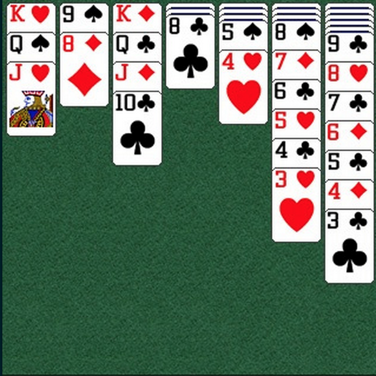

OOP2.6
============

UI Lab
------------

The goal of this lab is to replicate the layout below:

You do not need to provide card images. You can just use views of a random color. 
There are many ways to accomplish this task. You may decide to use UICollectionView, but if you find this difficult, try something else, because the re-usable cell logic that you get from UICollectionView will not be of any use in this layout (because all views are always visible all the time, and the screen does not scroll).

Goals
------------

- Implement a stacked solitaire interface using any method you like. Making the cards look like cards is not necessary. The layout is what is important. 
- You should be able to initialize your layout with some data (eg: there are 5 cards in column 1, 7 in 2, 3 in 3, etc...)

Bonus
-----------

- Can you implement drag and drop functionality so that you can drag cards between the stacks?

Tips
------------

- You can use UICollectionView, but it may be simpler to just create UIView instances and manage them yourself.
