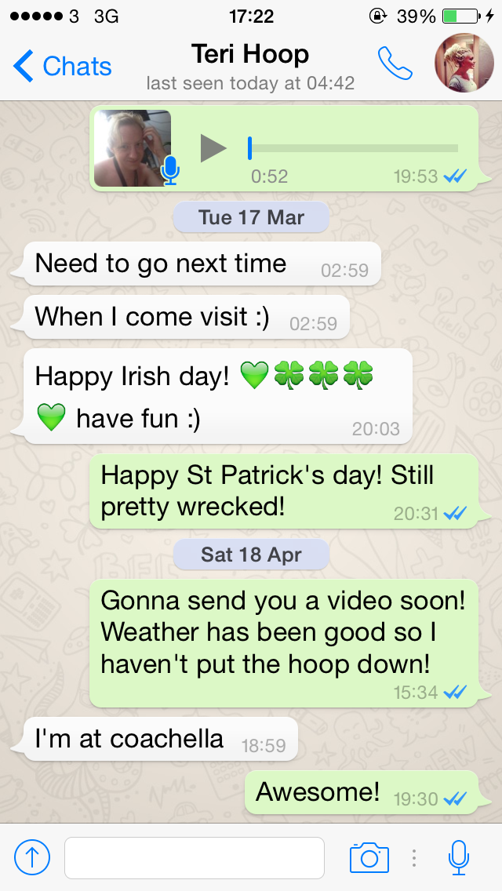

iOS2 Assignment
=====================

Your assignment is to copy the UI of the Whatsapp chat screen below. The UI should be able to accept new input in the UITextField, and append it to the list. No networking is necessary, or persistence.

Due Date
--------------------
15th June 2015

Requirements
--------------------

- A replica of the Whatsapp UI.
- Ability to append to the messages using the textfield.

Notes
-------------------

- Marks are provided for accuracy in replicating the UI. Try and replicate it as accurately as possible. Use any means you wish.

Grading
------------------

- 60% of marks are for replicating the UI.
- 15% of marks are for appending messages to the list.
- 15% of marks are for visual style and user interface design.
- 10% of marks are for sensible and clean code.

Rules
--------

You may use online libraries, resources, and tools to help you with your assignment. You may make use of any 3rd or 1st party libraries you wish. The only thing you may not do is copy code wholesale from the internet. I understand that an amount of code may be similar to resources you consulted online, and this is no problem, but large scale plagiarism will be dealt with drastically and may result in a mark of 0, or worse, disciplinary action from the exam board.

Submission
--------

Please create a **seperate** repository on your GitHub account, and call it 'Whatsapp'. Push your code to GitHub, including any dependencies / READMEs / info required to run, and email a link to **zac@getdrop.com** with the subject `DIT OOP Assignment 2015`.

Help
--------
If you are unsure on any of the above, please email me.
